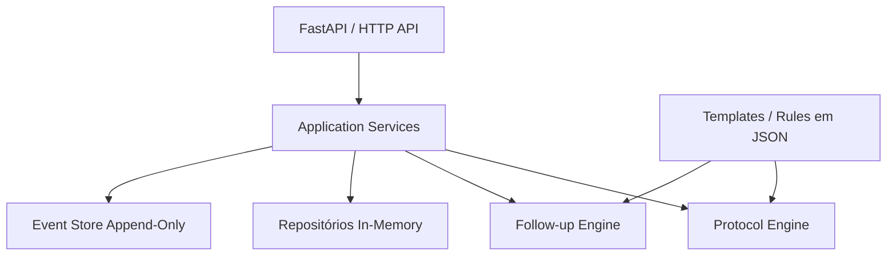

# journey-core-case

Core determinístico de jornada em saúde desenvolvido para o desafio técnico de backend da AINA Health.

O projeto modela uma jornada simples de saúde, desde a criação do paciente e aceite de termos até execução de protocolo, criação de Journey, acompanhamento de Tasks, avaliação de elegibilidade de follow-up e registro append-only de eventos.

A implementação prioriza:

- modelagem explícita de domínio;
- regras de negócio determinísticas e testáveis;
- configuração declarativa de protocolos e follow-up;
- controllers HTTP enxutos;
- design de eventos orientado à privacidade;
- separação clara entre orquestração, avaliação de regras e persistência.

## Stack tecnológica

- Python 3.12
- FastAPI
- Pydantic v2
- pytest
- Uvicorn
- Repositórios in-memory
- Regras de protocolo e follow-up em JSON

## Execução rápida

### Pré-requisitos

Você precisa ter:

- Git
- Python 3.12

Confirme a versão do Python:

```bash
python --version
```

Esperado:

```text
Python 3.12.x
```

### 1. Clone o repositório

```bash
git clone https://github.com/n4ndoz/journey-core-case.git
cd journey-core-case
```

### 2. Crie um ambiente virtual

#### Windows PowerShell

```powershell
py -3.12 -m venv .venv
.\.venv\Scripts\Activate.ps1
```

#### macOS / Linux

```bash
python3.12 -m venv .venv
source .venv/bin/activate
```

### 3. Instale o projeto

O extra `test` instala tanto as dependências de runtime quanto as dependências de teste:

```bash
python -m pip install --upgrade pip
python -m pip install -e ".[test]"
```

### 4. Configure o ambiente local

A aplicação exige um salt para geração determinística dos hashes.

#### Windows PowerShell

```powershell
Copy-Item .env.example .env
```

#### macOS / Linux

```bash
cp .env.example .env
```

O `.env.example` incluído contém um valor apenas para desenvolvimento local:

```text
PHONE_HASH_SALT=local-dev-salt-change-me
```

Em qualquer ambiente que não seja de demonstração, esse valor deve ser substituído por um segredo apropriado.

O arquivo `.env` local é ignorado pelo Git.

### 5. Execute a API

```bash
python -m uvicorn app.main:app --reload
```

A API ficará disponível em:

```text
http://127.0.0.1:8000
```

Documentação interativa Swagger:

```text
http://127.0.0.1:8000/docs
```

Health check:

```text
http://127.0.0.1:8000/health
```

Resposta esperada:

```json
{
  "status": "ok"
}
```

## Executando os testes

```bash
python -m pytest
```

Validação técnica final:

```text
148 passed
```

A suíte cobre modelos de domínio, repositórios, regras de protocolo, comportamento de skip do PHQ-2, criação de Journey, conclusão de Tasks, elegibilidade de follow-up, cooldown de 72 horas, contratos HTTP, imutabilidade de eventos, proteção de PII e cenários adversariais.

## Forma mais rápida de avaliar o projeto

A maneira mais simples de inspecionar o comportamento completo da aplicação é pelo Swagger:

```text
http://127.0.0.1:8000/docs
```

Um fluxo funcional completo exige poucas chamadas.

### 1. Criar um Patient

Use:

```text
POST /patients
```

Exemplo:

```json
{
  "phone": "+55 11 98888-1234",
  "name": "Paciente Teste",
  "birth_date": "1990-01-01",
  "sex": "M",
  "terms_accepted": true
}
```

Guarde o `patient_id` retornado.

### 2. Iniciar o protocolo PHQ-9

Use:

```text
POST /patients/{patient_id}/protocols
```

Body:

```json
{
  "template_id": "phq9"
}
```

Guarde o `session_id` retornado.

A primeira pergunta do PHQ-9 é devolvida na própria resposta.

### 3. Acionar a regra de encerramento antecipado do PHQ-2

Envie a resposta da questão 1:

```text
POST /protocol-sessions/{session_id}/answers
```

```json
{
  "question_id": "1",
  "value": 1
}
```

Depois envie a questão 2:

```json
{
  "question_id": "2",
  "value": 1
}
```

As duas primeiras respostas somam `2`.

Como a regra configurada é:

```text
sum(question_1, question_2) < 3
```

o protocolo é encerrado antecipadamente.

Resultado esperado:

```json
{
  "status": "completed",
  "next_question": null,
  "score": 2,
  "ended_by_skip": true
}
```

### 4. Consultar a Journey

Use:

```text
GET /patients/{patient_id}/journey
```

O protocolo concluído cria uma Journey semelhante a:

```json
{
  "status": "em_andamento",
  "objective": "Acompanhamento após protocolo clínico",
  "tasks": [
    {
      "title": "Realizar acompanhamento",
      "status": "in_progress"
    }
  ]
}
```

### 5. Avaliar elegibilidade de follow-up

Use:

```text
POST /followups/evaluate
```

```json
{
  "patient_id": "<patient_id>"
}
```

Para um Patient elegível, a primeira avaliação retorna:

```json
{
  "eligible": true,
  "template_key": "checkin_adesao",
  "reason": null
}
```

Execute imediatamente a mesma avaliação novamente.

Resultado esperado:

```json
{
  "eligible": false,
  "template_key": null,
  "reason": "cooldown"
}
```

### 6. Inspecionar a trilha de eventos

Use:

```text
GET /events?patient_id=<patient_id>
```

Para o fluxo acima, a trilha contém:

```text
patient_created
terms_accepted
protocol_started
protocol_completed
journey_created
followup_eligible
followup_skipped
```

O último `followup_skipped` contém:

```json
{
  "reason": "cooldown"
}
```

A trilha de eventos não contém telefone em claro, nome ou data de nascimento do Patient.

## Visão geral da API

| Método | Endpoint | Finalidade |
|---|---|---|
| `GET` | `/health` | Health check da aplicação |
| `POST` | `/patients` | Criar um Patient |
| `POST` | `/patients/{patient_id}/protocols` | Iniciar um protocolo |
| `POST` | `/protocol-sessions/{session_id}/answers` | Submeter a resposta atual do protocolo |
| `GET` | `/patients/{patient_id}/journey` | Consultar a Journey do Patient |
| `POST` | `/journeys/{journey_id}/tasks/{task_id}/complete` | Concluir uma Task da Journey |
| `POST` | `/followups/evaluate` | Avaliar elegibilidade determinística de follow-up |
| `GET` | `/events?patient_id=...` | Consultar a trilha pseudonimizada de eventos |

Os schemas interativos de request e response também estão disponíveis em `/docs`.

## Arquitetura

A aplicação segue uma arquitetura em camadas simples:



As responsabilidades são intencionalmente separadas:

| Camada | Responsabilidade |
|---|---|
| API | Transporte HTTP e mapeamento de respostas |
| Application Services | Orquestração de casos de uso e transições de estado |
| Domain Models | Estado de negócio e invariantes |
| Protocol Engine | Interpretação determinística das regras de protocolo |
| Follow-up Engine | Avaliação determinística das regras de follow-up |
| Configuração JSON | Conteúdo declarativo de protocolos e regras |
| Repositories | Persistência |
| Event Store | Registro append-only dos fatos relevantes |

Uma forma simples de resumir o design é:

> O código orquestra; a configuração declara o comportamento; os engines interpretam as regras; os repositories persistem o estado; o Event Store registra os fatos.

## Protocol Engine declarativo

As perguntas do protocolo não ficam hardcoded nos application services.

A definição do PHQ-9 está em:

```text
app/protocols/templates/phq9.json
```

O template define:

- identificador e versão do protocolo;
- prompt;
- perguntas;
- opções de resposta permitidas;
- regras de skip.

A regra atual de PHQ-2 é declarada assim:

```json
{
  "trigger": {
    "after_question": "2"
  },
  "condition": {
    "operator": "sum",
    "questions": ["1", "2"],
    "comparison": "lt",
    "value": 3
  },
  "action": "end_block"
}
```

O service não contém lógica como:

```text
if template_id == "phq9"
```

Alterações no conteúdo do questionário não exigem mudanças no application service.

O engine implementa deliberadamente apenas o vocabulário de regras necessário para o desafio, em vez de introduzir uma linguagem genérica de expressões.

## Regras de follow-up

A configuração de follow-up está em:

```text
app/followups/rules/default.json
```

As regras são avaliadas em ordem:

1. os termos devem ter sido aceitos;
2. pelo menos um protocolo deve estar concluído;
3. a Journey deve estar ativa;
4. pelo menos uma Task deve permanecer ativa;
5. não pode existir um evento `followup_eligible` nas últimas 72 horas.

A primeira regra que falha define o motivo tipado:

```text
missing_consent
protocol_not_completed
journey_not_active
no_active_task
cooldown
```

Quando todas as regras passam, é emitido:

```text
followup_eligible
```

com:

```text
template_key = checkin_adesao
```

Uma avaliação que resulta em `followup_skipped` não inicia um novo cooldown.

O cooldown considera apenas eventos anteriores de `followup_eligible`.

Ao completar exatamente 72 horas, o Patient volta a ser elegível.

## Journey e Tasks

A conclusão de um protocolo cria uma Journey simples:

```text
status: em_andamento
objective: Acompanhamento após protocolo clínico
```

com uma Task inicial:

```text
Realizar acompanhamento
```

Os estados de Task são:

```text
in_progress
completed
```

O desafio não define conclusão automática da Journey quando a última Task é concluída. Por isso, nenhuma transição adicional de Journey é introduzida.

## Modelo de eventos

Transições relevantes geram eventos append-only com o envelope:

```text
event_id
occurred_at
event_name
patient_id_hash
properties
```

Os eventos suportados são:

```text
patient_created
terms_accepted
protocol_started
protocol_completed
journey_created
task_completed
followup_eligible
followup_skipped
```

As `properties` de cada evento são modeladas por schemas Pydantic explícitos com:

```text
extra="forbid"
```

Isso evita a inclusão silenciosa de campos arbitrários nos eventos.

## Privacidade e tratamento de PII

A implementação separa os dados operacionais do Patient da trilha de eventos.

O Patient armazena dados operacionais como:

```text
phone
name
birth_date
sex
```

O telefone é normalizado e armazenado também como hash SHA-256 com salt:

```text
SHA256(salt + normalized_phone)
```

Uma identidade pseudonimizada separada é gerada para os eventos:

```text
SHA256(salt + "patient:" + patient_id)
```

Essa separação é intencional.

Dois Patients diferentes podem compartilhar o mesmo telefone e, portanto, o mesmo `phone_hash`, mas recebem `patient_id_hash` distintos e mantêm históricos de eventos completamente isolados.

O Event Store usa `patient_id_hash`, e não `phone_hash`.

Os eventos não contêm:

```text
phone
name
birth_date
```

Erros de validação HTTP também são sanitizados para evitar ecoar valores potencialmente sensíveis da requisição.

A implementação foi desenhada considerando princípios de LGPD e proteção de PII, mas não deve ser interpretada como uma alegação de conformidade regulatória completa para um sistema de saúde em produção.

## Imutabilidade do Event Store

O Event Repository in-memory usa cópias profundas nas fronteiras de persistência e leitura.

Alterar:

- o objeto originalmente emitido;
- um objeto retornado por `list_all`;
- um objeto retornado por `list_by_patient`;

não altera o evento persistido.

Isso preserva semanticamente o comportamento append-only mesmo em uma implementação in-memory.

## Comportamento de erros

Erros de domínio são mapeados para respostas HTTP explícitas.

Exemplos:

```text
patient_not_found
protocol_template_not_found
protocol_session_not_found
journey_not_found
task_not_found
consent_required
protocol_already_completed
task_already_completed
question_mismatch
invalid_answer
```

Falhas de validação utilizam uma resposta sanitizada:

```json
{
  "error": "validation_error",
  "message": "Invalid request"
}
```

Dessa forma, entradas malformadas não são ecoadas no corpo do erro.

## Estrutura do projeto

```text
.
├── app/
│   ├── domain/
│   │   ├── enums.py
│   │   ├── errors.py
│   │   ├── event_properties.py
│   │   └── models.py
│   ├── followups/
│   │   ├── rules/
│   │   │   └── default.json
│   │   ├── engine.py
│   │   ├── loader.py
│   │   └── models.py
│   ├── protocols/
│   │   ├── templates/
│   │   │   └── phq9.json
│   │   ├── engine.py
│   │   └── loader.py
│   ├── repositories/
│   │   └── in_memory.py
│   ├── security/
│   │   └── hashing.py
│   ├── services/
│   ├── api.py
│   ├── api_schemas.py
│   ├── dependencies.py
│   ├── error_handlers.py
│   └── main.py
├── tests/
├── .env.example
├── pyproject.toml
└── README.md
```

## Persistência

A persistência é intencionalmente in-memory.

Isso mantém o foco do desafio em regras de domínio, comportamento determinístico e arquitetura, em vez de infraestrutura de banco de dados.

Reiniciar a aplicação apaga todo o estado em memória.

Os repositories estão separados da lógica de negócio, de forma que substituir a implementação in-memory por adapters persistentes não exigiria mover as regras de negócio para a camada HTTP.

## Premissas e trade-offs

Alguns comportamentos foram mantidos simples porque o desafio não os especifica:

- unicidade de telefone não é imposta;
- múltiplas sessões de protocolo podem ser iniciadas para o mesmo Patient;
- concluir uma Task não marca automaticamente a Journey como `concluida`;
- falhas de follow-up utilizam a primeira regra configurada que falha;
- apenas eventos `followup_eligible` participam do cooldown de 72 horas;
- os engines implementam apenas o vocabulário determinístico necessário para as configurações fornecidas, em vez de uma DSL genérica.

Essas são decisões explícitas de escopo.

## Fora de escopo

O projeto intencionalmente não implementa:

- autenticação ou autorização;
- WhatsApp ou envio real de mensagens;
- integrações com LLM ou agentes;
- banco de dados persistente;
- dashboard ou GUI;
- infraestrutura de deployment;
- distributed locking;
- infraestrutura de idempotência;
- CQRS;
- event sourcing completo;
- novas fórmulas clínicas além da soma configurada no protocolo.

O objetivo é manter um journey core pequeno, determinístico e testável.

## Validação final

A validação técnica final incluiu:

```text
148 testes automatizados aprovados
startup da API com Uvicorn
GET /health -> 200
GET /docs -> 200
fluxo manual de skip do PHQ-2
criação da Journey
followup_eligible
cooldown de 72 horas
inspeção pseudonimizada do Event Store
```

O happy path completo também foi executado manualmente pela interface Swagger gerada pelo FastAPI.
