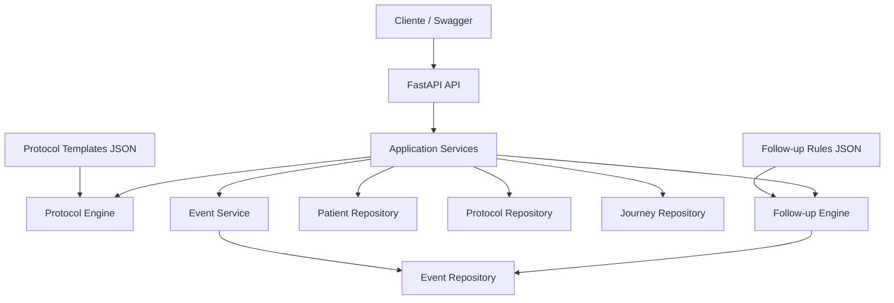
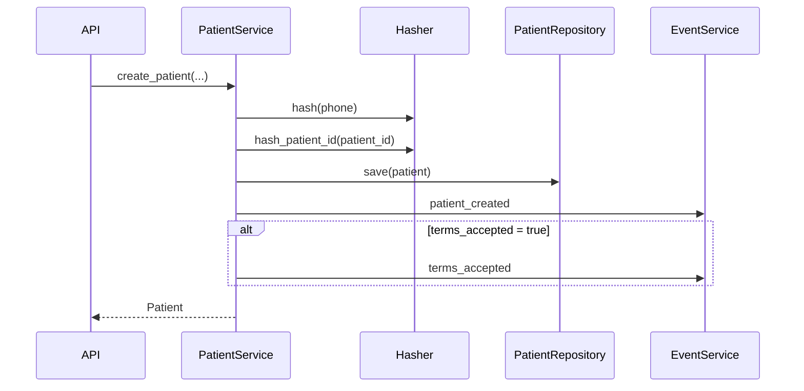
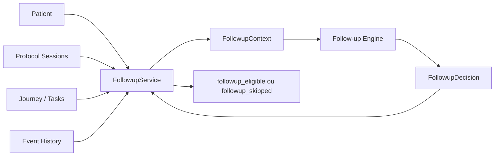
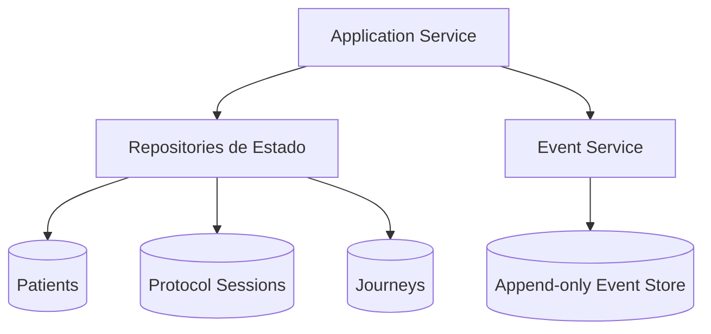
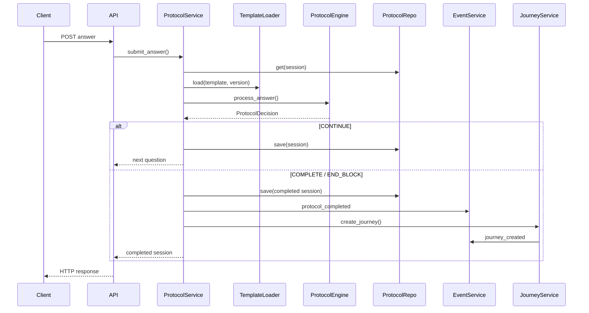
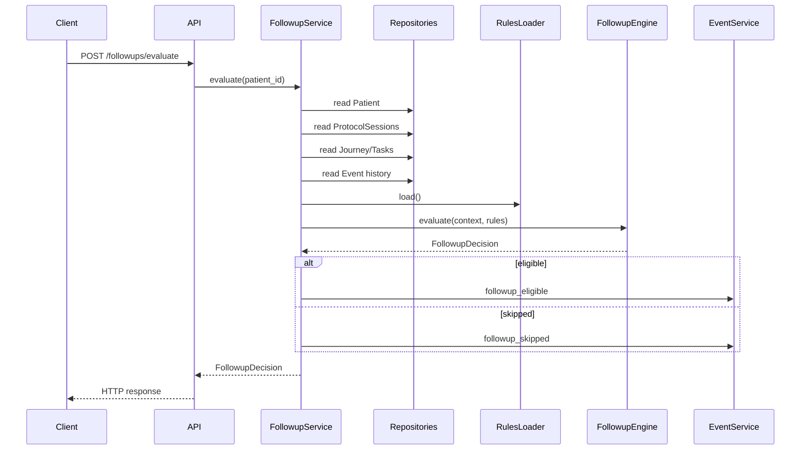

# Arquitetura

Este documento descreve a arquitetura do `journey-core-case`, as responsabilidades de cada camada e as principais decisões técnicas adotadas.

Para contratos HTTP, consulte [`API_REFERENCE.md`](API_REFERENCE.md).

Para regras de negócio e comportamento do domínio, consulte [`DOMAIN_RULES.md`](DOMAIN_RULES.md).

---

## Objetivo arquitetural

O objetivo do projeto é implementar um core de jornada em saúde pequeno, determinístico e testável, mantendo as regras de negócio separadas da camada HTTP e evitando complexidade arquitetural desnecessária para o escopo do desafio.

A arquitetura foi desenhada para responder a quatro necessidades principais:

- manter contratos HTTP separados da lógica de negócio;
- permitir protocolos e regras de follow-up declarativos;
- centralizar transições de estado em Application Services;
- manter uma trilha de eventos pseudonimizada e append-only.

A ideia central pode ser resumida como:

> O código orquestra; a configuração declara o comportamento; os engines interpretam as regras; os repositories persistem o estado; o Event Store registra os fatos.

---

# Visão geral



O fluxo de dependências permanece predominantemente da borda da aplicação em direção ao domínio e aos componentes de infraestrutura.

---

# Camadas e responsabilidades

## 1. API

Arquivos principais:

```text
app/main.py
app/api.py
app/api_schemas.py
app/error_handlers.py
```

A camada HTTP é responsável por:

- receber requests;
- validar contratos com Pydantic;
- converter parâmetros HTTP para tipos de domínio;
- chamar Application Services;
- montar responses;
- traduzir erros de domínio para status HTTP.

A API não implementa regras de protocolo, cálculo de score, decisão de follow-up ou persistência diretamente.

Exemplo conceitual:

```text
HTTP Request
    ↓
Pydantic Schema
    ↓
Application Service
    ↓
Domain Result
    ↓
HTTP Response
```

O FastAPI também gera automaticamente o contrato OpenAPI e a interface Swagger disponível em `/docs`.

---

# Application Services

Arquivos:

```text
app/services/
├── patient_service.py
├── protocol_service.py
├── journey_service.py
├── followup_service.py
└── event_service.py
```

Os Services representam os casos de uso da aplicação.

Eles são responsáveis por coordenar:

- leitura de estado existente;
- validação de pré-condições;
- chamada dos Engines;
- transições de estado;
- persistência;
- emissão de eventos.

Eles não devem conter conteúdo clínico hardcoded nem funcionar como motores genéricos de regras.

---

## PatientService

Responsável pela criação de Patients.

Fluxo simplificado:



O Service também estabelece a separação entre:

- `phone_hash`, derivado do telefone;
- `patient_id_hash`, identidade pseudonimizada utilizada nos eventos.

---

## ProtocolService

Responsável pelo ciclo de vida de uma ProtocolSession.

Principais operações:

```text
start_protocol
submit_answer
```

Ao iniciar uma sessão, o Service:

1. recupera o Patient;
2. valida consentimento;
3. carrega o template;
4. cria uma ProtocolSession;
5. persiste a sessão;
6. emite `protocol_started`.

Ao receber uma resposta:

1. recupera a sessão;
2. recupera o Patient;
3. carrega a mesma versão do template utilizada no início;
4. delega a decisão ao `ProtocolEngine`;
5. aplica a decisão;
6. persiste a sessão;
7. quando concluída, emite `protocol_completed`;
8. solicita a criação da Journey.

O Service não possui lógica específica do PHQ-9.

Não existe, por exemplo:

```text
if template_id == "phq9"
```

A decisão sobre continuar ou encerrar o protocolo pertence ao Engine e à configuração declarativa.

---

## JourneyService

Responsável por operações relacionadas à Journey e suas Tasks.

Atualmente coordena:

- criação de Journey após conclusão de protocolo;
- criação da Task inicial;
- conclusão de Tasks;
- emissão dos eventos associados.

A criação da Journey é disparada pelo `ProtocolService` quando a ProtocolSession passa para `completed`.

Essa decisão mantém o fluxo de aplicação explícito:

```text
Protocol completed
        ↓
ProtocolService
        ↓
JourneyService
        ↓
Journey created
```

---

## FollowupService

Responsável por construir o contexto necessário para avaliação de follow-up.

Ele consulta:

- Patient;
- ProtocolSessions;
- Journey;
- Tasks;
- histórico de eventos.

A partir desses dados, constrói um `FollowupContext` e delega a decisão ao `FollowupEngine`.

Fluxo:



O Engine recebe estado já interpretado e não acessa diretamente repositories ou HTTP.

Essa separação permite testar a regra de follow-up de forma isolada.

---

# Engines

Existem dois componentes responsáveis por decisão determinística:

```text
ProtocolEngine
FollowupEngine
```

Um Engine:

- recebe estado estruturado;
- recebe configuração validada;
- avalia regras;
- devolve uma decisão.

Um Engine não:

- acessa FastAPI;
- persiste entidades;
- emite eventos diretamente;
- conhece detalhes de infraestrutura;
- executa código arbitrário vindo da configuração.

---

## ProtocolEngine

Localização:

```text
app/protocols/engine.py
```

O Engine interpreta:

- questão atual;
- resposta;
- respostas anteriores;
- ordem das questões;
- regras de skip declaradas no template.

A saída é uma decisão de domínio semelhante a:

```text
CONTINUE
END_BLOCK
COMPLETE
```

com dados associados, como:

```text
next_question_id
score
ended_by_skip
```

O `ProtocolService` é quem transforma essa decisão em mudança de estado persistida.

Isso produz a separação:

```text
Engine decide
Service aplica
Repository persiste
Event Service registra
```

---

## FollowupEngine

Localização:

```text
app/followups/engine.py
```

O Engine recebe um contexto de avaliação contendo informações como:

```text
terms_accepted
protocol_completed
journey_status
tasks
last_followup_eligible_at
evaluated_at
```

e uma configuração declarativa de regras.

O resultado é um `FollowupDecision`:

```text
eligible
template_key
reason
```

A emissão de:

```text
followup_eligible
```

ou:

```text
followup_skipped
```

permanece responsabilidade do `FollowupService`.

---

# Configuração declarativa

Duas partes importantes do comportamento ficam fora do código de orquestração.

## Protocol templates

Localização:

```text
app/protocols/templates/
```

Template atual:

```text
phq9.json
```

O template contém:

- identificador;
- versão;
- prompt;
- perguntas;
- opções;
- regras de skip.

O template é carregado por:

```text
TemplateLoader
```

e interpretado pelo:

```text
ProtocolEngine
```

Fluxo:

```text
phq9.json
    ↓
TemplateLoader
    ↓
ProtocolTemplate
    ↓
ProtocolEngine
```

O conteúdo do protocolo é, portanto, tratado como dado configurável.

---

## Follow-up rules

Localização:

```text
app/followups/rules/
```

Configuração atual:

```text
default.json
```

É carregada por:

```text
FollowupRulesLoader
```

e interpretada por:

```text
FollowupEngine
```

Fluxo:

```text
default.json
    ↓
FollowupRulesLoader
    ↓
FollowupRules
    ↓
FollowupEngine
```

A implementação deliberadamente evita `eval`, AST dinâmica ou uma DSL genérica.

Somente o vocabulário de regras necessário ao domínio atual é suportado.

---

# Domain Models

Os modelos centrais ficam em:

```text
app/domain/
```

Principais entidades e value objects:

```text
Patient
ProtocolTemplate
Question
QuestionOption
ProtocolAnswer
ProtocolSession
Journey
Task
Event
```

Também ficam no domínio:

```text
Enums
Domain Errors
Event Properties
```

Os modelos Pydantic fornecem:

- validação;
- tipos explícitos;
- invariantes locais;
- serialização estruturada.

A validação de regras que dependem de múltiplos agregados permanece nos Services ou Engines, em vez de ser forçada para dentro de um único modelo.

---

# Persistência

A persistência é implementada em:

```text
app/repositories/in_memory.py
```

Existem quatro repositories:

```text
PatientRepository
ProtocolRepository
JourneyRepository
EventRepository
```

Cada repository possui uma responsabilidade específica.

---

## PatientRepository

Indexa Patients por:

```text
patient_id
```

Operações principais:

```text
save
get
```

---

## ProtocolRepository

Persiste ProtocolSessions.

Operações:

```text
save
get
list_by_patient
```

---

## JourneyRepository

Persiste Journeys.

Operações:

```text
save
get
get_by_patient
```

---

## EventRepository

Funciona como Event Store append-only em memória.

Operações:

```text
append
list_by_patient
list_all
```

Diferentemente dos repositories operacionais, o Event Repository não possui operação de update ou delete.

---

# Estado operacional vs. trilha de eventos

Uma decisão importante da arquitetura é não utilizar event sourcing completo.

O sistema possui duas formas complementares de armazenamento:

```text
Operational State
+
Event Trail
```

Exemplo:



Os repositories de estado representam a visão atual das entidades.

O Event Store registra fatos relevantes ocorridos ao longo da jornada.

Portanto:

```text
JourneyRepository
```

responde:

> Qual é o estado atual da Journey?

Enquanto:

```text
EventRepository
```

responde:

> Quais fatos relevantes aconteceram para esse Patient?

Isso evita a complexidade de reconstruir o estado atual exclusivamente a partir dos eventos.

---

# Event Service

O `EventService` centraliza a criação de eventos.

Os Application Services não precisam construir manualmente todo o envelope.

Conceitualmente:

```text
Application Service
        ↓
EventService.emit(...)
        ↓
Event
        ↓
EventRepository.append(...)
```

O envelope é:

```text
event_id
occurred_at
event_name
patient_id_hash
properties
```

Os `properties` utilizam schemas específicos por tipo de evento.

Isso permite restringir explicitamente os campos aceitos.

---

# Imutabilidade do Event Store

Embora o armazenamento seja in-memory, o Event Repository aplica deep copies nas fronteiras de escrita e leitura.

Ao executar:

```text
append(event)
```

é persistida uma cópia profunda.

Ao executar:

```text
list_by_patient(...)
list_all()
```

também são devolvidas cópias.

Dessa forma, um consumidor não consegue alterar acidentalmente o evento armazenado modificando uma referência Python já retornada.

O objetivo é preservar a semântica append-only mesmo sem banco de dados.

---

# Pseudonimização

O sistema mantém duas identidades derivadas distintas.

## `phone_hash`

Derivado de:

```text
SHA256(salt + normalized_phone)
```

Atende ao requisito de hash do telefone.

## `patient_id_hash`

Derivado de:

```text
SHA256(salt + "patient:" + patient_id)
```

É utilizado na trilha de eventos.

A separação evita utilizar o telefone como identidade do Event Store.

Exemplo:

```text
Patient A ─┐
           ├── mesmo telefone → mesmo phone_hash
Patient B ─┘

Patient A → patient_id A → patient_id_hash A
Patient B → patient_id B → patient_id_hash B
```

Assim, dois registros de Patient que eventualmente compartilhem o mesmo telefone continuam tendo trilhas de eventos independentes.

---

# Composition Root

A composição dos componentes ocorre em:

```text
app/dependencies.py
```

Esse arquivo instancia:

```text
Repositories
Loaders
Engines
EventService
Application Services
```

e conecta explicitamente suas dependências.

Exemplo conceitual:

```text
PatientRepository ───────────────┐
PhoneHasher ─────────────────────┤
EventService ────────────────────┤
                                ↓
                         PatientService
```

e:

```text
PatientRepository ───────┐
ProtocolRepository ──────┤
TemplateLoader ──────────┤
ProtocolEngine ──────────┤
EventService ────────────┤
JourneyService ──────────┤
                         ↓
                  ProtocolService
```

Para o escopo do desafio, foi escolhido um composition root explícito e simples em vez de introduzir um container de Dependency Injection.

---

# Ciclo de vida em memória

Os repositories são instanciados uma vez no composition root do processo da aplicação.

Consequentemente, durante uma execução do servidor:

```text
request 1
request 2
request 3
     ↓
mesmas instâncias de repository
```

compartilham o mesmo estado.

Quando o processo da aplicação é reiniciado:

```text
estado em memória → perdido
```

Essa característica é deliberada e compatível com o escopo do desafio.

---

# Inicialização e configuração

A aplicação é criada em:

```text
app/main.py
```

A configuração `.env` é carregada antes dos imports que instanciam componentes dependentes do salt.

Fluxo simplificado:

```text
load_dotenv()
    ↓
import router/dependencies
    ↓
PhoneHasher()
    ↓
FastAPI app
```

Essa ordem é importante porque o `PhoneHasher` exige:

```text
PHONE_HASH_SALT
```

durante a composição da aplicação.

A ausência da variável faz a aplicação falhar rapidamente durante a inicialização em vez de operar silenciosamente com hashing inconsistente.

---

# Tratamento de erros

Erros de domínio são definidos independentemente do FastAPI.

Exemplos:

```text
PatientNotFound
ConsentRequired
ProtocolAlreadyCompleted
QuestionMismatch
InvalidAnswer
TaskAlreadyCompleted
```

A camada HTTP converte esses erros em responses apropriadas.

Fluxo:

```text
Service / Engine
      ↓
DomainError
      ↓
FastAPI exception handler
      ↓
HTTP status + error code
```

Isso impede que Services precisem conhecer status codes HTTP.

Também permite testar regras de domínio sem executar um servidor web.

---

# Fluxo completo de protocolo

O principal fluxo da aplicação pode ser representado assim:



O ponto importante é que o Engine decide o que deve acontecer, mas não realiza efeitos colaterais.

---

# Fluxo completo de follow-up



Novamente, decisão e efeitos colaterais permanecem separados.

---

# Direção das dependências

Uma visão simplificada:

```text
API
 ↓
Application Services
 ↓
Domain / Engines
 ↓
Repositories / Event Service
```

Configuração declarativa entra através dos Loaders:

```text
JSON
 ↓
Loader
 ↓
Typed Models
 ↓
Engine
```

Não existe dependência dos Engines para FastAPI.

Também não existe acesso HTTP ou persistência dentro dos templates JSON.

---

# Estratégia de testes

A separação arquitetural permite testar componentes em níveis diferentes.

## Domain tests

Validam:

```text
models
enums
invariantes
```

## Engine tests

Validam decisões sem HTTP:

```text
ProtocolEngine
FollowupEngine
```

## Service tests

Validam:

```text
orquestração
persistência
event emission
state transitions
```

## Repository tests

Validam comportamento de armazenamento, incluindo imutabilidade do Event Store.

## API tests

Validam:

```text
schemas
status codes
error mapping
end-to-end use cases
PII boundaries
```

Essa abordagem evita depender exclusivamente de testes end-to-end para verificar regras simples de domínio.

---

# Decisões arquiteturais

## 1. Monólito modular em vez de microservices

O domínio do desafio é pequeno e executado como uma única aplicação.

Separá-lo em serviços distribuídos adicionaria:

- comunicação de rede;
- consistência distribuída;
- observabilidade adicional;
- deployment independente;

sem benefício proporcional ao problema.

Por isso, foi utilizado um monólito modular.

---

## 2. In-memory persistence em vez de banco de dados

O desafio permite persistência in-memory.

A prioridade foi investir complexidade em:

- regras;
- testes;
- contratos;
- privacidade;
- arquitetura.

Os repositories isolam a persistência, deixando um caminho claro para adapters persistentes no futuro.

---

## 3. Estado atual + eventos em vez de event sourcing

Eventos são usados como trilha de fatos, mas não como fonte única de verdade.

Essa decisão mantém:

- consultas simples;
- fluxo explícito;
- baixo custo cognitivo;

sem abrir mão de auditabilidade básica.

---

## 4. Configuração declarativa em vez de protocolo hardcoded

Conteúdo e regras específicas do protocolo ficam em JSON.

Isso reduz acoplamento entre:

```text
questionário
```

e:

```text
Application Service
```

O mesmo princípio é aplicado às regras de follow-up.

---

## 5. Engines específicos em vez de rule engine genérico

O projeto não implementa uma plataforma genérica de regras.

Os Engines conhecem apenas um vocabulário pequeno e explícito de operações suportadas.

Isso favorece:

- previsibilidade;
- legibilidade;
- segurança;
- facilidade de teste.

---

## 6. Erros de domínio independentes de HTTP

Services e Engines levantam erros de negócio.

A API realiza o mapeamento para HTTP.

Isso evita acoplamento entre:

```text
regra de domínio
```

e:

```text
protocolo de transporte
```

---

## 7. EventService centralizado

A emissão de eventos passa por um único componente.

Isso reduz duplicação na construção do envelope e cria um ponto claro de extensão caso a persistência de eventos mude.

---

## 8. Pseudonimização separada do hash de telefone

`phone_hash` e `patient_id_hash` possuem responsabilidades distintas.

Essa separação evita transformar um identificador derivado de PII em identidade operacional da trilha de eventos.

---

# O que deliberadamente não foi introduzido

A arquitetura não inclui:

```text
CQRS
full Event Sourcing
message broker
event bus
Unit of Work
generic dependency injection container
generic rule DSL
microservices
distributed transactions
background workers
ORM
database abstraction framework
```

Esses componentes poderiam ser úteis em sistemas maiores, mas não são necessários para resolver os requisitos atuais.

A decisão foi privilegiar a menor arquitetura que preservasse corretamente as fronteiras importantes do problema.

---

# Evolução possível

Sem alterar as regras centrais, a arquitetura permite algumas evoluções naturais.

## Persistência

Os repositories in-memory poderiam ser substituídos por adapters para:

```text
PostgreSQL
Firestore
SQLite
```

mantendo os Application Services como consumidores da abstração de persistência.

## Novos protocolos

Novos templates podem ser adicionados ao diretório:

```text
app/protocols/templates/
```

desde que utilizem o vocabulário suportado pelo `ProtocolEngine`.

## Novas regras de follow-up

A configuração declarativa pode evoluir dentro do vocabulário explicitamente suportado pelo `FollowupEngine`.

## Mensageria

Um sistema real poderia consumir decisões `followup_eligible` para acionar uma camada externa de mensageria.

Essa integração está deliberadamente fora do core atual.

---

# Resumo

A arquitetura separa cinco responsabilidades principais:

```text
HTTP transport
      ↓
Use-case orchestration
      ↓
Deterministic rule evaluation
      ↓
State persistence
      +
Append-only event trail
```

O resultado é um core pequeno em número de componentes, mas com fronteiras explícitas entre:

- transporte;
- negócio;
- configuração;
- persistência;
- auditoria.

Essa separação permite que o comportamento principal seja testado de forma determinística sem depender da camada HTTP ou de infraestrutura externa.
